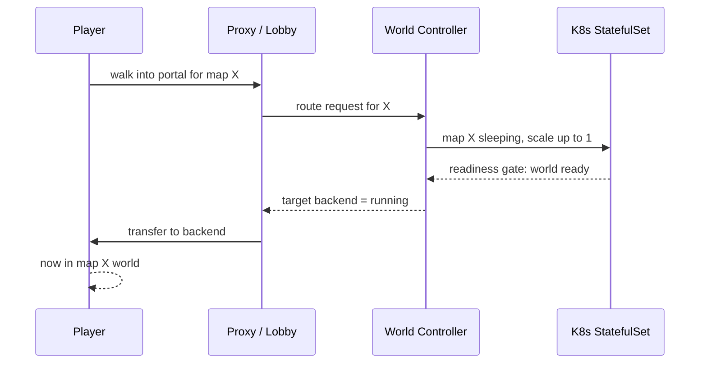

# Step 10 — Portal → wake → transfer

Combine Steps 8 and 9 into the defining player flow: a player walks into a portal, the target world wakes from zero, and the player is transferred there.

This is the architecture's signature behavior — "the world sleeps; the portal wakes it."

## Goal

A player entering a portal for a currently-sleeping map is held briefly, the map wakes (scale-to-zero → running), and the player is moved there — without being dropped.

## Flow



## Tasks

### 1. Define the wake-and-wait path

- Portal or `/join` resolves map → runtime → backend via the controller (Step 8).
- If asleep, scale up and wait (Step 9).

### 2. Hold the player during wake

While the backend is waking, the player stays in the lobby with a clear message (e.g. "Preparing map…"). Only transfer when the readiness gate reports ready.

### 3. Transfer on readiness

Once `running`, transfer the player exactly like Step 7's `/join`, preserving identity and presence.

### 4. Handle failure

If the wake fails or times out, return the player to a safe state with a clear message rather than dropping them into the void.

## Acceptance criteria

```text
[ ] portal on a sleeping map wakes it automatically
[ ] player is held (not disconnected) during wake
[ ] player transfers once world is ready
[ ] timeout/failure leaves the player safely in the lobby
[ ] repeated use converges (no infinite wake loop)
```

## Next step

[Step 11 — Exact map presence + TAB](step-11-tab-exact.md)