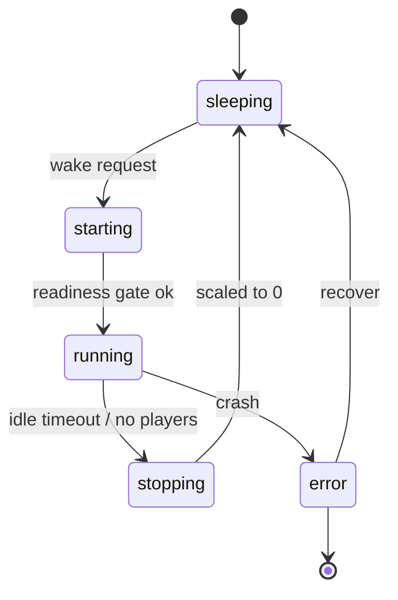

# MapInstance schema

A **MapInstance** represents one playable map/world and its current lifecycle state, as tracked by the World Controller (Step 8).

## Schema

```yaml
mapId: string                 # stable identifier, e.g. "backrooms-001"
runtimeId: string             # references a RuntimeDefinition, e.g. "fantasy-1.20.1-forge"
state: string                 # sleeping | starting | running | stopping | error
backend:
  host: string                # DNS/address of the host backend, when running
  port: int
  scaleToZero: bool           # whether this map uses persistent scale-to-zero
  agones: bool                # whether this uses Agones (optional)
world:
  pvcName: string             # persistent volume for world data
  lastChanged: timestamp
activity:
  lastSeen: timestamp         # last player activity (for idle sleep)
  playerCount: int
  busyUntil: timestamp
```

## Lifecycle states



## Examples

```yaml
mapId: backrooms-001
runtimeId: backrooms-current
state: running
backend: { hostId: "backrooms-001-0", port: 25565, scaleToZero: true }
world: { storagePath: "backrooms-001-pvc", lastChanged: "2026-08-01" }
activity: { lastSeen: "2026-08-19T12:00:00Z", playerCount: 3 }
```

## See also

- [Step 8 — World Controller](../01-implement/step-08-world-controller.md)
- [Step 9 — Scale-to-zero](../01-implement/step-09-scale-to-zero.md)
- [Step 10 — Portal wake flow](../01-implement/step-10-portal-wake-transfer.md)