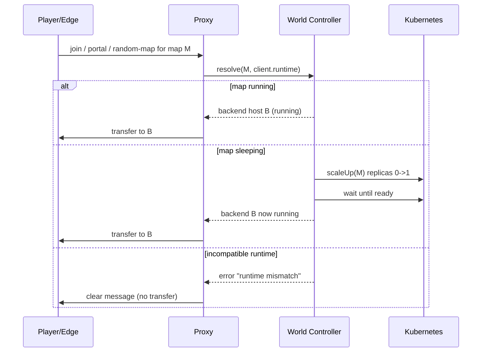

# Routing & wake state machine

How a player request to a map is resolved into a transfer, including the wake path for sleeping maps.

## The flow

## States

| State | Meaning | Next |
|-------|---------|------|
| `sleeping` | 0 replicas, world on PVC | wake on request |
| `starting` | scaling up, world loading | ready |
| `running` | ready, accept transfer | idle → stopping |
| `stopping` | scaling to 0 | sleeping |
| `error` | crashed / timeout | recover |

## Compatibility gate

Before routing, the controller verifies the requester's runtime is in the target map's `runtimeId`'s `compatibleClients`. If not, the player is **not** transferred (Step 12/15).

## Timeouts

- **Wake timeout**: if not ready within `T`, fail to `error` and return the player to the lobby with a message.
- **Idle timeout**: after no players for `I`, trigger scale-to-zero.

Tune `T` and `N` per runtime (a Forge runtime takes longer to wake than vanilla).

## See also

- [Step 8 — World Controller](../01-implement/step-08-world-controller.md)
- [Step 10 — Portal wake flow](../01-implement/step-10-portal-wake-transfer.md)
- [MapInstance schema](map-instance.md)