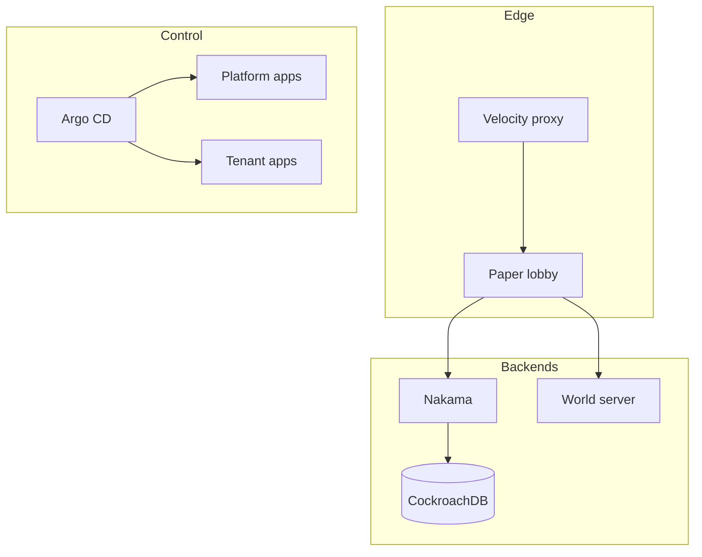

# Infrastructure Architecture

This documents how the Minecraft network is operated from `infra/`. It is the
operator-facing companion to the platform design in
`docs/reference-design/` (which explains *why* components were chosen).

## Layer overview

## Host layout

- **alpha** — RKE2 control-plane server (`rke2_servers`).
- **build01** — build node (`build_nodes`) for packaging worlds/plugins.

See `inventory/production.yml` for group membership.

## GitOps

Argo CD bootstraps two roots:

- `kubernetes/platform` — shared platform components (proxy, lobby).
- `kubernetes/tenants` — tenant-owned workloads (game backends).

## Secrets

Secrets (RKE2 token, DB passwords, Tailscale authkey) are never committed.
They are injected at the right phase via `ansible-vault`, sealed-secrets, or
env-provided values. See `ansible/README.md` and `.gitignore`.