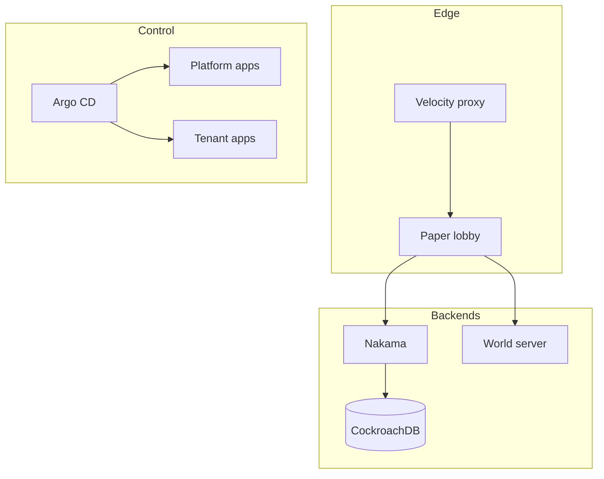

# Infrastructure Architecture

This documents how the Minecraft network is operated from `infra/`. It is the
operator-facing companion to the platform design in
`docs/reference-design/` (which explains *why* components were chosen).

## Layer overview

## Host layout

The platform host (`alpha`) and the RKE2 cluster are owned by
[`42WASD/ubuntu-server-iac`](https://github.com/42WASD/ubuntu-server-iac). This
repo carries only the Minecraft **game-layer** workloads that run on that
cluster.

## GitOps

Argo CD is bootstrapped by the platform repo and points at the game workloads
here:

- `clusters/alpha` — game components (namespace, proxy/lobby, Nakama,
  CockroachDB), aggregated by kustomize.

## Secrets

Secrets (DB passwords, Nakama API keys) are never committed. They are injected
via `sealed-secrets` or env-provided values, following the platform repo's
secret conventions.